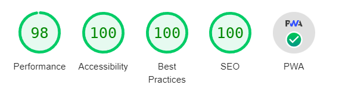

# 📕 About

<p align="center">


</p>

Yet another weather PWA, not much innovation to see here.

A few highlights if you're still interested:
* Zero js dependencies (other than React, of course ;)) for the funs.
* Installable and works offline.
* Pretty clean code with a focus on making the app as performant and lightweight as possible.
<p align="center"></p>


# Running it locally

Both ViteJS and netlify CLI are needed to run locally, the former used as app bootstrap and the latter to make netlify functions (used for reverse geocoding features) work.
Once that's configured and the env variables are set, it should run with:
```sh
npm install

netlify dev
```
# 🗄️ Project Structure

Most of the code lives in the `src` folder and looks like this:

```sh
src
|
+-- components        # shared components used across the entire application
|
+-- features          # feature based modules
|
+-- pages            # pages
|
+-- utils             # shared utility functions & types
```
